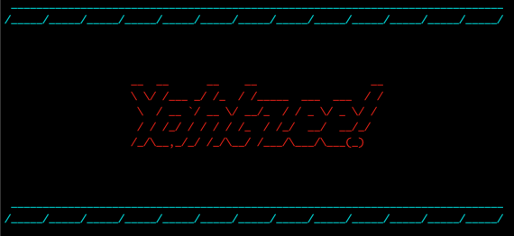
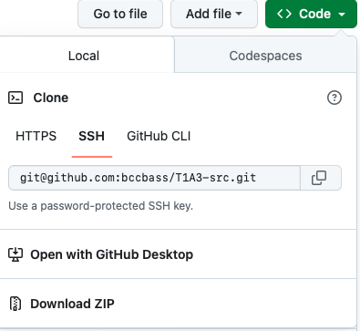
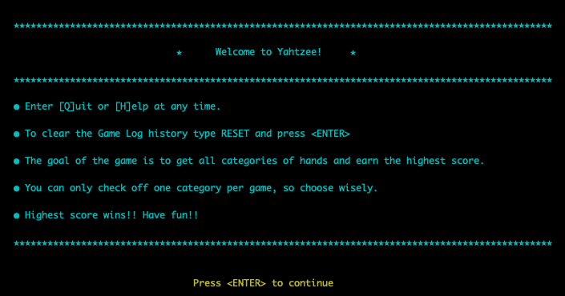

# Yahtzee! README

##### Benjamin Campbell • Assignment T1A3 • May 11, 2023  

</br>

## Help Documentation:
### **Recommended Hardware Requirements:***
- Modern Operating System:
    - Windows 7 or 10
    - Mac OS X 10.11 or higher, 64-bit
    - Linux: RHEL 6/7, 64-bit (almost all libraries also work in Ubuntu)
- x86 64-bit CPU (Intel / AMD architecture). ARM CPUs are not supported.
- 4 GB RAM
- 5 GB free disk space

##### [*Entought](https://support.enthought.com/hc/en-us/articles/204273874-Enthought-Python-Minimum-Hardware-Requirements)

### **Software Requirements:**
- Python 3.10 or higher
- Any Terminal application with a minimum view width of 110 columns

**********
### *Installation and Gameplay:  


1. **Check Python Install Status**: Python 3.10 or higher must be installed to run Yahtzee.

    To check if Python is installed locally and verify current version open a new terminal window and enter:
    ```
    python --version
    ```
    This should return a message that looks like this:
    ```
    Python 3.11.3
    ```  
    If Python is not installed or version is lower than 3.10 please visit Python's [download page](https://www.python.org/downloads/) for more information including download access and installation instructions.  

    https://www.python.org/downloads/  


2. **Download and Install Yahtzee**: 
    - Navigate to the [Github Repository](https://github.com/bccbass/T1A3-src)
    - Locate the Code tab in the repository and select 'Download ZIP':

        


    - Alternatively you can click the download link [here](https://github.com/bccbass/T1A3-src/archive/refs/heads/main.zip) to start an immediate download.


3. **Play Yahtzee**: 
     Open a new Terminal window and navigate to the src folder. This navigation is different depending on where a folder is located in the users home directory, however the navigation commands may look something like this:
        ```bash
        cd user/downloads/T1A3-src
        ```

    From within the ```T1A3-src``` directory in any terminal window enter:
    ```bash
    bash yahtzee.sh
    ```
    This command will activate a virtual environment, install the required dependencies and run the program in python.

    *Note: In some instances the bash permissions may need to be reset to allow execution. If permissions error occurs run the following commands from the src directory in the terminal window*
    ```bash
    chmod +x ./yahtzee.sh

    chmod +x ./clear-score-log.sh
    ```


4. **Play Yahtzee**: Game play is straightforward with clearly written prompts. Type ```[Q]uit``` or ```[H]elp``` at anytime throughout the program to exit or query a help card with game instructions.

     To clear the stored game history enter ```RESET``` at any point in the game. Alternately one can run ```./clear-score-log.sh``` from the ```src``` directory in the terminal window for the same results. 

     
******

### Required dependencies:
```
colorama==0.4.6
iniconfig==2.0.0
packaging==23.1
pluggy==1.0.0
pyfiglet==0.8.post1
pytest==7.3.1
```
